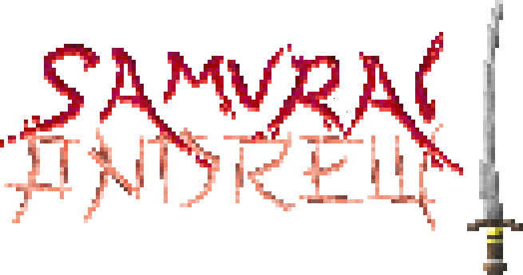

[Andrew Kurauchi, Phd](https://github.com/toshikurauchi). Design de Software. [Insper](https://github.com/Insper), 2020.

<h1 align="center">

</h1>

<p align="center">
A Python game made with <b>Pygame</b>!
</p>


## How to Play

1. Clone this repository with the following command:
    ```bash
    $ git clone https://github.com/FelixLuciano/Samurai-Andrew.git
    ```
2. Enter the folder:
    ```bash
    $ cd Samurai-Andrew
    ```
3. Then run the game:
    ```bash
    $ python src\index.py
    ```
4. Press any button to start the game.
5. Slice flying fruits with your mouse and dont fall in the void.
6. **Have fun!**

## Demo

Watch this demo video on youtube by clicking the following link:

[youtu.be/YfFVtREranc](https://youtu.be/YfFVtREranc)

## License
This game is [MIT Licensed](LICENSE)!
